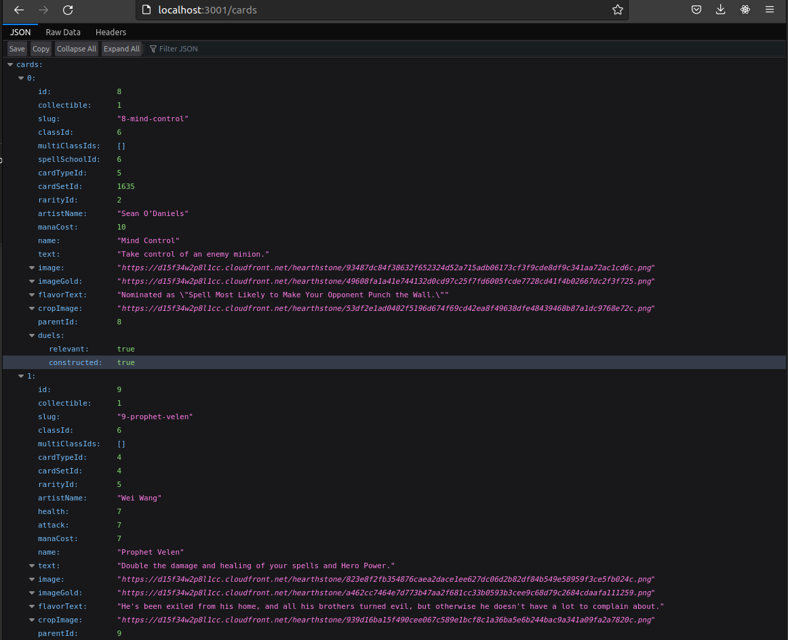

# Battle.net > Hearthstone API Proxy (Back-end)

Interacts with your account via the Battle.net Hearthstone API to
display your Card inventory, among other things.

## Creds

You must [Create an API Client](https://develop.battle.net/documentation/guides/getting-started)
and then provide the credentials via environment variables.

```bash
export BATTLE_NET_CLIENT_ID=...
export BATTLE_NET_CLIENT_SECRET=...
```

You can also optionally override the default Battle.net region and locale.

```bash
export BATTLE_NET_REGION=us
export BATTLE_NET_LOCALE=en_US
```

## Installation

There are a few dependencies we must fetch one-time, prior to startup.

```bash
npm install
```

## Startup

To launch the web server process:

```bash
npm start
```

Then browse to http://localhost:3000/cards

## Screenshots

