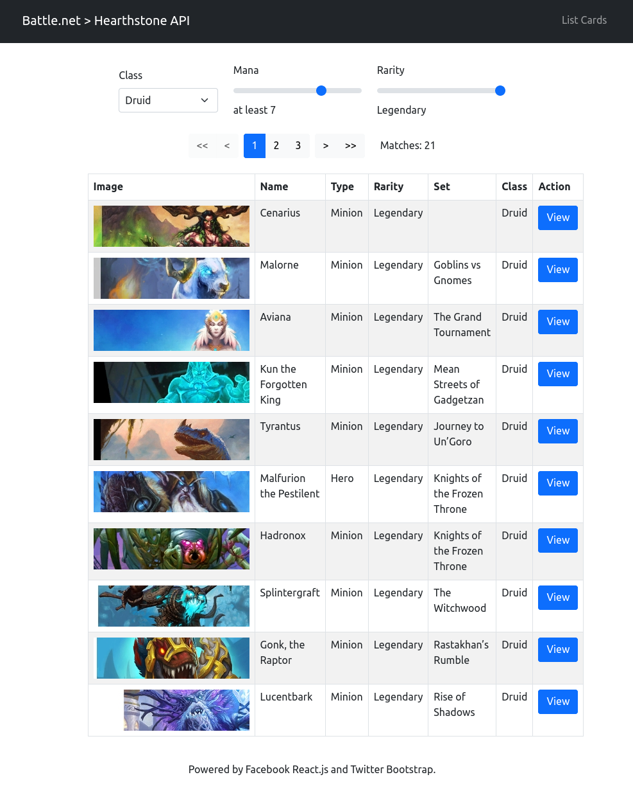

# Battle.net > Hearthstone API Client (Front-end)

## 1. Interactive (Development Mode)

```bash
npm start
```

Open [http://localhost:3000](http://localhost:3000) to view it in your browser.

This version will hot-reload as you make changes.
You will also see any lint errors in the console.

## 2. Static Build (Production Release)

```bash
npm run build
```

Builds the app for production to the `build` folder.\
It correctly bundles React in production mode and optimizes the build for the best performance.

You can host the static build like so:

```bash
npx serve -s build/
```

## Screenshots



